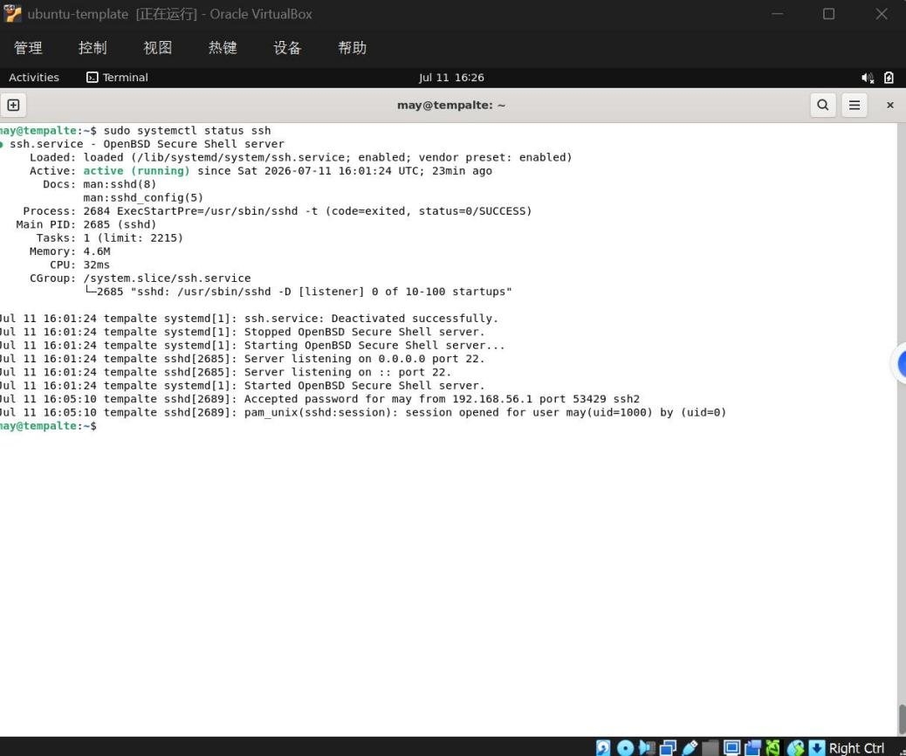
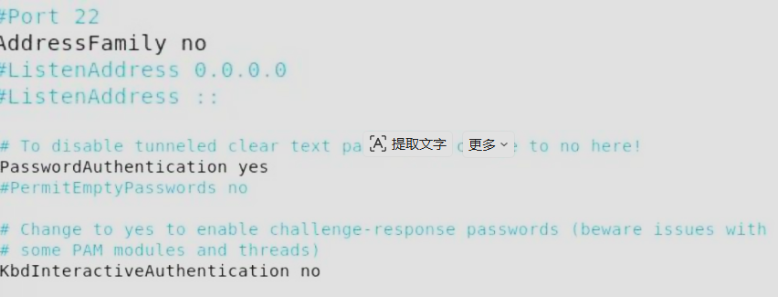
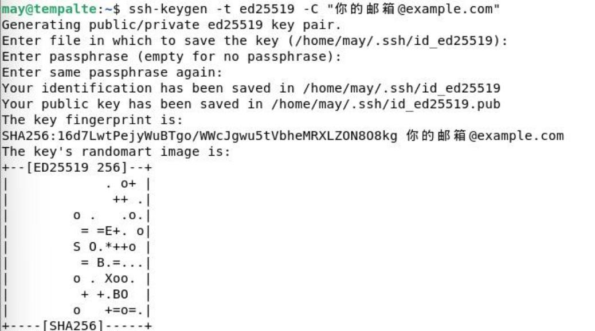

# 实验七：SSH 服务配置与文件传输

## 第一部分：SSH 服务安装与基础配置

### 步骤一：检查 SSH 服务状态

```bash
sudo systemctl status ssh                    # 检查服务状态
sudo apt install openssh-server -y           # 如未安装
sudo systemctl enable ssh                    # 设置开机自启
```

### 步骤二：配置 SSH 服务器

编辑 `/etc/ssh/sshd_config`：

```bash
sudo nano /etc/ssh/sshd_config
```

关键配置项：

```
# Port 22                        # 默认端口
PermitRootLogin no               # 禁止root直接登录
PubkeyAuthentication yes         # 允许公钥认证
PasswordAuthentication yes       # 允许密码认证
```

重启服务：

```bash
sudo systemctl restart ssh
```



## 第二部分：SSH 密钥认证配置

### 步骤三：生成 SSH 密钥对（在 node1 上）

```bash
ssh-keygen -t ed25519 -C "你的邮箱@example.com"
```

生成后查看：

```bash
ls ~/.ssh/
# id_ed25519（私钥）和 id_ed25519.pub（公钥）
```



### 步骤四：将公钥复制到远程服务器

```bash
ssh-copy-id dev@192.168.56.102
```

### 步骤五：测试免密登录

```bash
ssh dev@192.168.56.102
```

应无需密码直接登录。



## 第三部分：文件传输

### 步骤六：使用 SCP 传输文件

```bash
# 上传文件
scp /home/dev/test.txt dev@192.168.56.102:/home/dev/

# 上传目录
scp -r /home/dev/project/ dev@192.168.56.102:/home/dev/

# 下载文件
scp dev@192.168.56.102:/home/dev/log.txt ./

# 下载目录
scp -r dev@192.168.56.102:/home/dev/backup/ ./
```

### 步骤七：使用 rsync 同步文件

```bash
# 安装rsync
sudo apt install rsync -y

# 本地同步
rsync -avz /home/dev/source/ /home/dev/backup/

# 推送到远程
rsync -avz -e ssh /home/dev/project/ dev@192.168.56.102:/home/dev/project/

# 从远程拉取
rsync -avz -e ssh dev@192.168.56.102:/home/dev/logs/ ./logs/

# 保持完全一致（--delete会删除目标中多余的文件）
rsync -avz --delete -e ssh /home/dev/source/ dev@192.168.56.102:/home/dev/dest/

# 排除特定文件
rsync -avz --exclude='*.log' --exclude='tmp/' -e ssh /home/dev/ dev@192.168.56.102:/home/dev/
```
