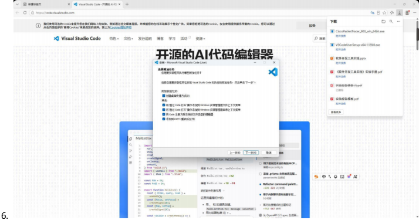
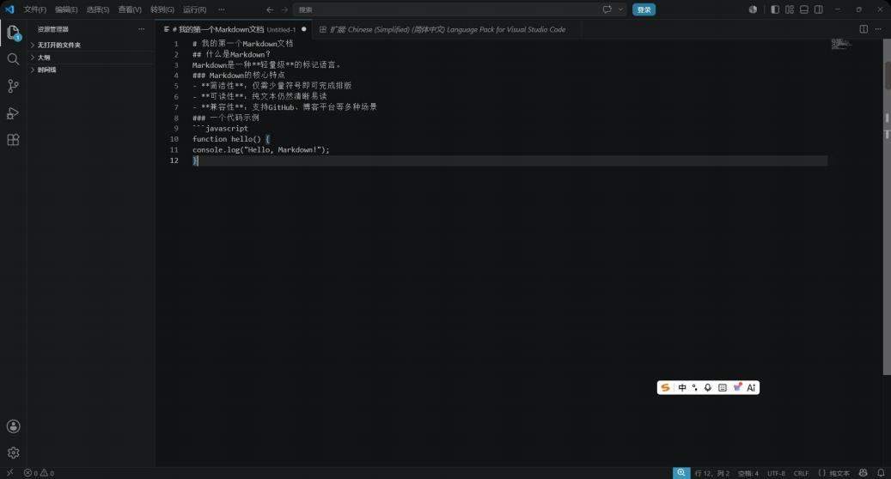
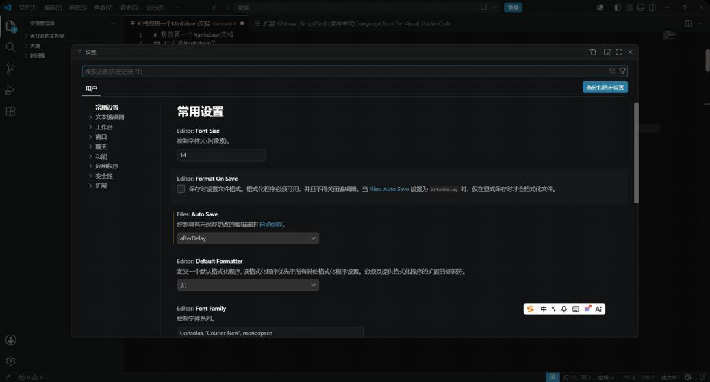
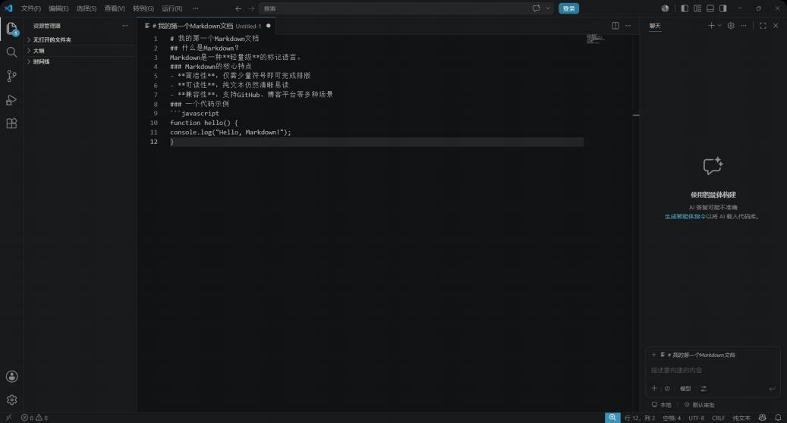

# 实验三：Visual Studio Code 安装与 Markdown 写作环境配置

## 步骤一：安装 Visual Studio Code

1. 打开浏览器，访问 VS Code 官网：https://code.visualstudio.com/
2. 点击首页的 "Download for Windows" 按钮，下载最新版本的安装包。

3. 双击下载的安装包，启动安装向导。
4. 在 "选择附加任务" 页面，建议勾选以下选项：
   - 创建桌面快捷方式
   - 将"通过Code打开"操作添加到Windows资源管理器文件上下文菜单
   - 将"通过Code打开"操作添加到Windows资源管理器目录上下文菜单
   - 将Code注册为受支持的文件类型的编辑器
   - 添加到PATH（必须勾选）
5. 点击 "安装" 开始安装。

## 步骤二：首次运行与界面熟悉

1. 双击桌面上的 VS Code 快捷方式图标启动。
2. 熟悉 VS Code 的主界面布局：

   - **活动栏**（左侧最窄的竖条）：包含资源管理器、搜索、源代码管理、运行和调试、扩展等图标
   - **侧边栏**（活动栏右侧）：显示当前活动栏工具的具体内容
   - **编辑器区域**（中央）：用于编辑文件的主要区域
   - **面板**（底部）：显示终端、输出、问题等
   - **状态栏**（底部最下方）：显示当前文件信息、Git分支、编码格式等

## 步骤三：安装 Markdown 相关插件

### 3.1 打开扩展面板
点击左侧活动栏中的扩展图标（四个小方块组成的图标）或使用快捷键：`Ctrl + Shift + X`

### 3.2 安装核心插件

- **Markdown All in One**：目录生成、快捷键支持、自动完成、列表自动延续等
- **Markdown Preview Enhanced**：数学公式（LaTeX）、流程图（Mermaid）、导出为PDF/HTML等
- **Paste Image（可选）**：直接粘贴剪贴板中的图片到Markdown文件

## 步骤四：配置编辑器优化写作体验

1. **开启自动保存**：按 `Ctrl + ,` 打开设置，搜索 `files.autoSave`，设置为 `afterDelay`
2. **开启单词折行**：搜索 `editor.wordWrap`，设置为 `on`
3. **配置图片粘贴路径**（如安装了 Paste Image 插件）：设置 `Paste Image: Path Type` 为 `relative`

## 步骤五：创建并编辑第一个 Markdown 文件

1. 新建文件：`Ctrl + N`，保存为 `test.md`
2. 输入 Markdown 内容测试

