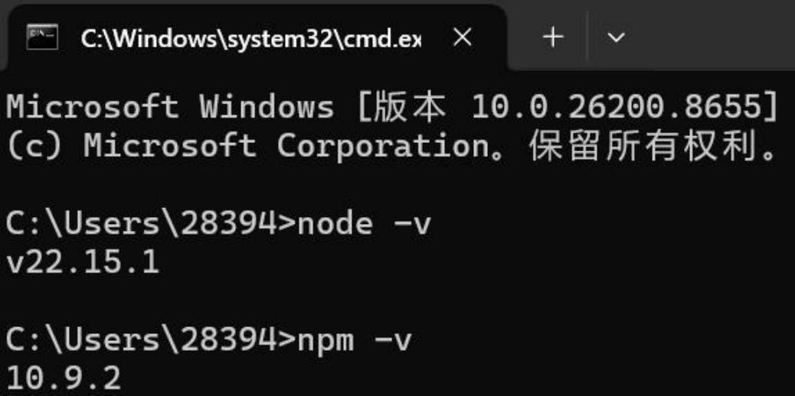
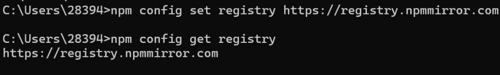
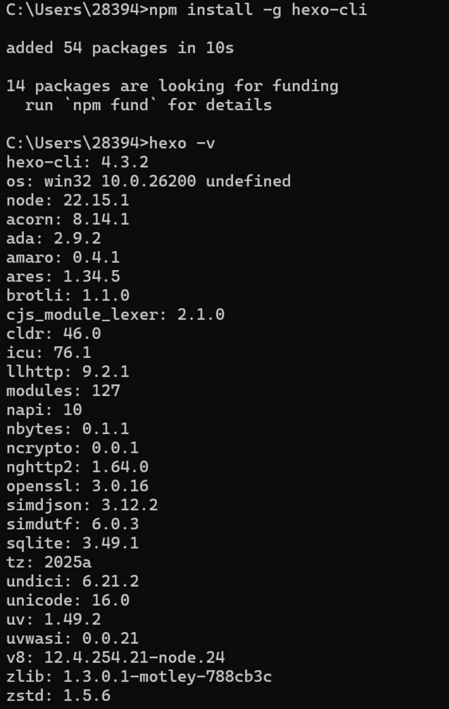
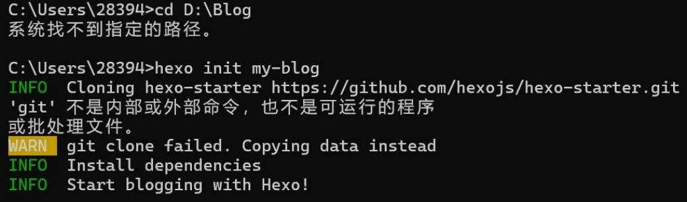
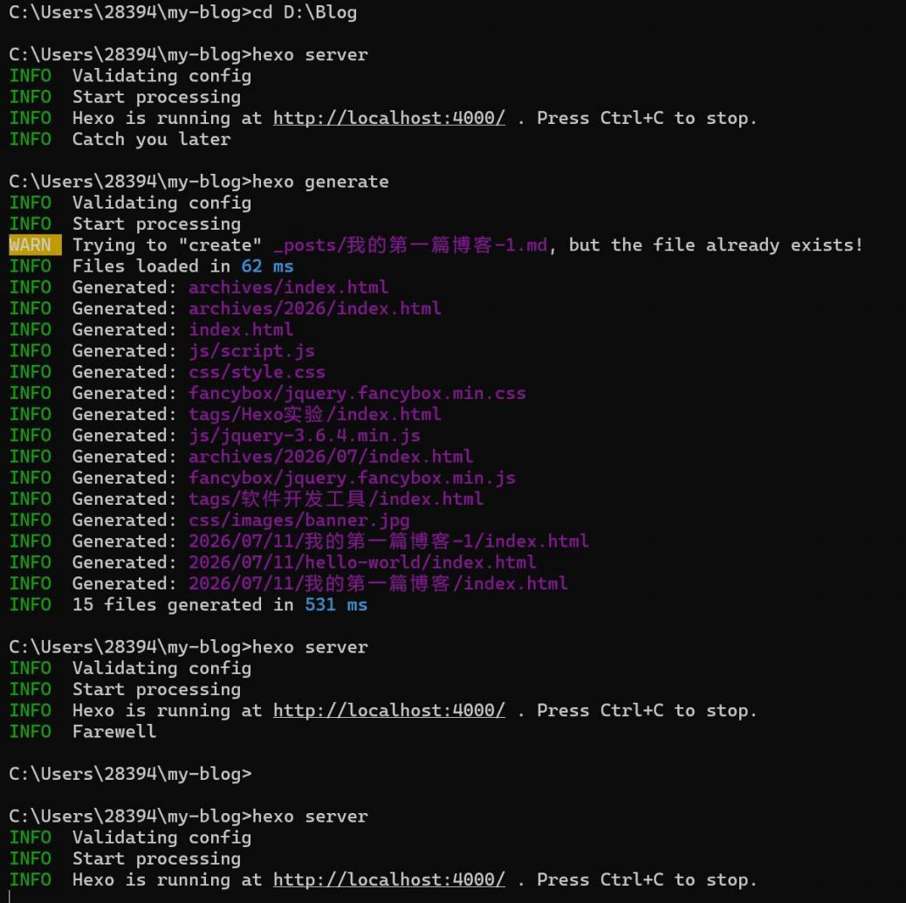

# 实验二：Node.js 与 Hexo 环境搭建

## 步骤 1：安装并验证 Node.js

国外官网访问缓慢，使用国内阿里镜像下载 Node.js LTS 长期支持版安装包，安装时勾选自动工具安装与 Add to PATH 环境变量选项。安装完成后打开 CMD，输入验证命令：

```bash
node -v
npm -v
```

窗口正常输出版本号，代表安装成功。



## 步骤 2：配置国内 npm 镜像源

国外源下载速度慢，切换淘宝镜像加速，CMD 执行两条配置命令：

```bash
npm config set registry https://registry.npmmirror.com
npm config get registry
```

控制台返回淘宝镜像地址即配置完成。



## 步骤 3：全局安装 Hexo 脚手架

执行安装与验证命令：

```bash
npm install -g hexo-cli
hexo -v
```

控制台输出完整 hexo 版本、系统环境信息，说明 Hexo 工具安装完成。



## 步骤 4：初始化 Hexo 博客项目

尝试切换 D 盘 Blog 文件夹失败，提示路径不存在，直接在用户目录初始化项目：

```bash
hexo init my-blog
cd my-blog
npm install
```

执行 `hexo init` 时提示 'git' 不是内部或外部命令，缺少 Git 工具，程序自动复制模板文件，不影响基础功能使用。



## 步骤 5：启动本地博客预览服务

输入启动命令：

```bash
hexo server
```

控制台打印提示 `Hexo is running at http://localhost:4000`，打开浏览器访问地址，查看默认博客首页；按下 `Ctrl+C` 可停止 Web 预览服务。


