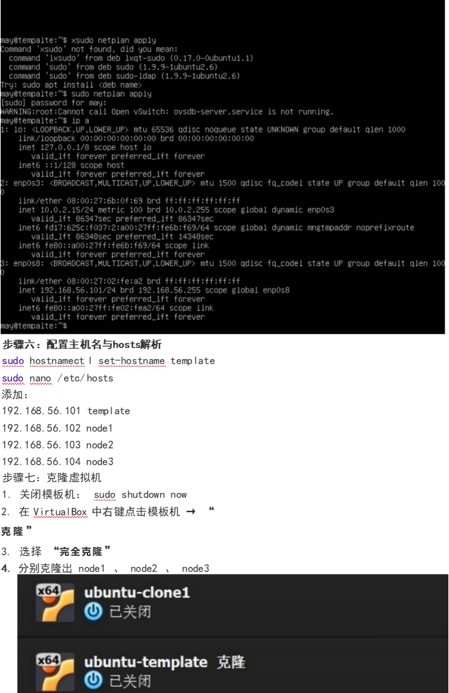
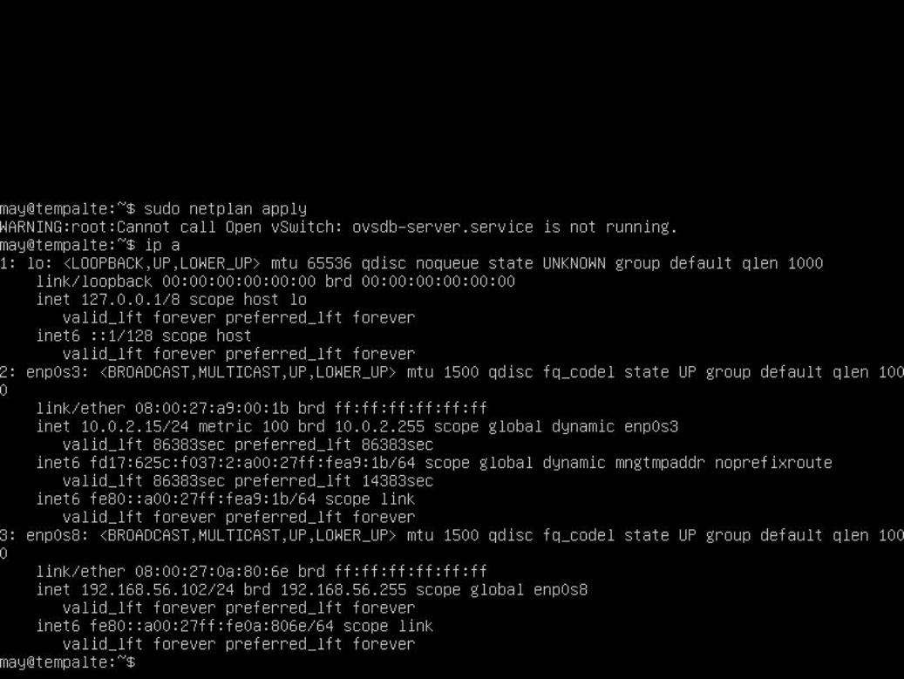
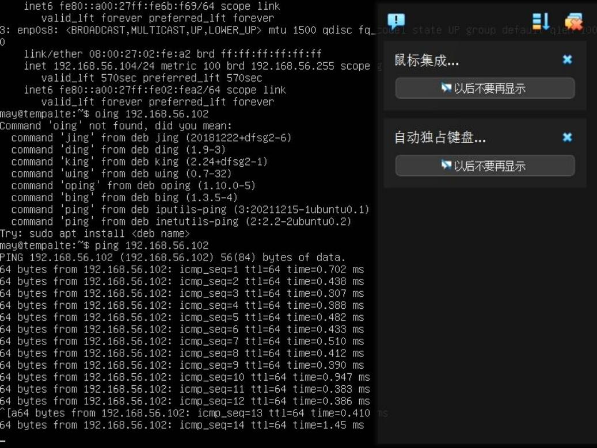

# 实验五：多台 Ubuntu Server 虚拟机环境搭建

## 步骤一：下载与安装 VirtualBox
1. 访问 VirtualBox 官网：https://www.virtualbox.org/
2. 下载 Windows 版本安装包并安装。
3. 安装完成后启动 VirtualBox。


## 步骤二：下载 Ubuntu Server ISO 镜像
访问 Ubuntu 官网：https://ubuntu.com/download/server ，下载 22.04 LTS 版本。

## 步骤三：创建第一台虚拟机（模板机）

### 3.1 新建虚拟机
- 名称：ubuntu-template
- ISO映像：选择下载的 Ubuntu Server ISO
- 类型：Linux，版本：Ubuntu (64-bit)


### 3.2 分配硬件资源
- 内存：2048 MB 或以上
- 硬盘：VDI 格式，动态分配，20 GB 或以上

### 3.3 配置虚拟机网络（双网卡）
- 网卡1：NAT 模式（用于上网）
- 网卡2：仅主机（Host-Only）模式（用于虚拟机间通信）


.png)

## 步骤四：安装 Ubuntu Server
1. 启动虚拟机，选择 "Try or Install Ubuntu Server"
2. 选择语言和键盘布局
3. 网络配置保持默认 DHCP
4. 存储配置选择 "Use an entire disk"
5. 设置用户名和密码
6. 勾选 "Install OpenSSH server"
7. 等待安装完成后重启

## 步骤五：配置静态 IP 地址
登录系统后，编辑 Netplan 配置文件：
```bash
sudo nano /etc/netplan/50-cloud-init.yaml
```
修改为：
```yaml
network:
  version: 2
  renderer: networkd
  ethernets:
    enp0s3:   # NAT网卡
      dhcp4: yes
    enp0s8:   # 仅主机网卡
      dhcp4: no
      addresses:
        - 192.168.56.101/24
      nameservers:
        addresses: [8.8.8.8, 114.114.114.114]
```
应用配置：
```bash
sudo netplan apply
```


## 步骤六：配置主机名与 hosts 解析
```bash
sudo hostnamectl set-hostname template
sudo nano /etc/hosts
```
添加：
```
192.168.56.101 template
192.168.56.102 node1
192.168.56.103 node2
192.168.56.104 node3
```

## 步骤七：克隆虚拟机
1. 关闭模板机：`sudo shutdown now`
2. 在 VirtualBox 中右键点击模板机 → "克隆"
3. 选择 "完全克隆"
4. 分别克隆出 node1、node2、node3



## 步骤八：修改克隆机的主机名和 IP
对每台克隆机：
```bash
sudo hostnamectl set-hostname node1   # 分别改为 node1/node2/node3
sudo nano /etc/netplan/50-cloud-init.yaml   # 修改IP为192.168.56.102/103/104
sudo netplan apply
```



## 步骤九：验证多机环境
在 node1 上测试：
```bash
ping -c 3 8.8.8.8                # 测试外网
ping -c 3 192.168.56.1           # 测试宿主机
ping -c 3 node2                  # 测试其他虚拟机
ping -c 3 node3
```


