# 实验八：VitePress 项目搭建与 CI/CD 自动化部署

## 步骤一：本地搭建 VitePress 项目并构建成功

### 1. 环境确认
确保你的电脑已安装 Node.js 20 及以上版本。
```bash
node --version    # 应显示 v20.x.x 或更高
npm --version     # 应显示 10.x.x 或更高
```

### 2. 创建项目目录并初始化
```bash
mkdir myblog
cd myblog
npm init -y
```

### 3. 安装 VitePress
```bash
npm add -D vitepress@latest
```

### 4. 使用安装向导初始化项目结构
```bash
npx vitepress init
```

### 5. 本地启动开发服务器
```bash
npm run docs:dev
```

### 6. 验证构建是否成功
```bash
npm run docs:build
```

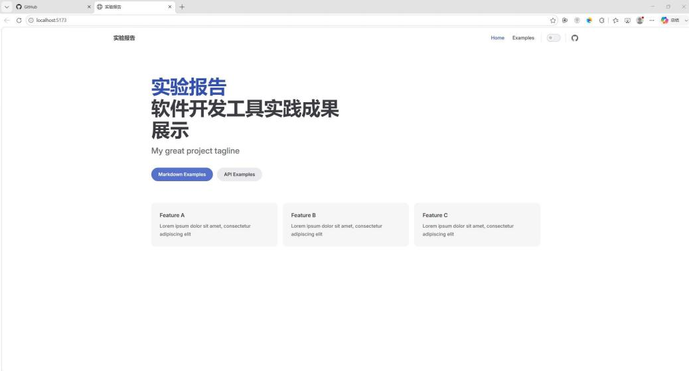
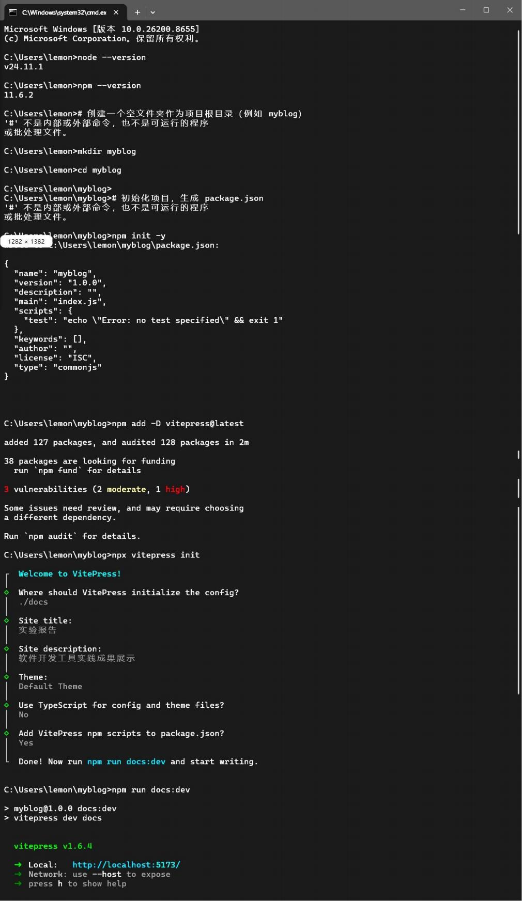

## 步骤二：将代码推送到 GitHub 仓库

### 1. 在 GitHub 上创建远程仓库

### 2. 初始化 Git 仓库并关联远程仓库
```bash
git init
git add .
git commit -m "初始化VitePress项目"
```

### 3. 修复 .gitignore
创建 `.gitignore` 文件，添加以下内容：
```
# Node.js依赖目录
node_modules/
# 缓存目录（VitePress等）
.cache/
.vitepress/cache/
# 构建输出目录
dist/
build/
# 环境变量文件
.env
.env.local
# 操作系统文件
.DS_Store
Thumbs.db
# 日志文件
*.log
```
批量移除已追踪的忽略文件：
```powershell
git ls-files -ci --exclude-standard | % { git rm --cached "$_" }
```

### 4. 提交并推送
```bash
git remote add origin https://github.com/66776776/teamblog.git
git add .
git commit -m "移除node_modules和缓存文件的追踪，添加.gitignore"
git branch -M main
git push origin main
```

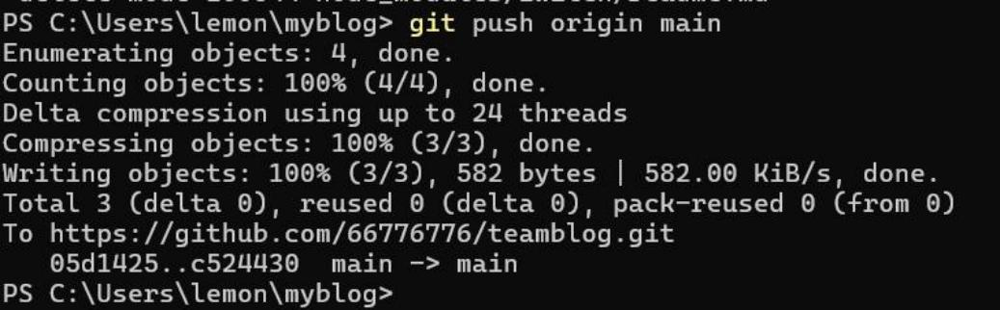
.png)

## 步骤三：服务器基础环境配置

### 1. 连接服务器
```bash
ssh root@你的服务器公网IP
```

### 2. 安装 Nginx
```bash
sudo apt install nginx -y
sudo systemctl start nginx
sudo systemctl enable nginx
```

### 3. 安装 Node.js 和 npm
```bash
curl -fsSL https://rpm.nodesource.com/setup_20.x | sudo bash -
sudo yum install -y nodejs
```

### 4. 验证
```bash
node --version
npm --version
git --version
sudo systemctl status nginx
```

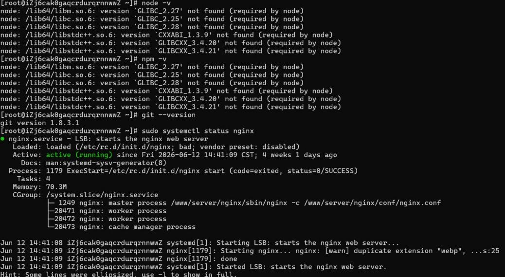

## 步骤四：配置网络安全

1. 登录阿里云控制台 → 云服务器 ECS → 安全组，添加入方向规则（80、443、22 端口）
2. 配置服务器内部防火墙：
```bash
sudo ufw allow 80/tcp
sudo ufw allow 443/tcp
sudo ufw allow 22/tcp
sudo ufw enable
```

## 步骤五：配置 Nginx 托管网站

### 1. 创建网站目录
```bash
sudo mkdir -p /www/wwwroot/myblog
```

### 2. 配置 Nginx 站点
创建 `/www/server/nginx/conf/myblog.conf`：
```nginx
server {
    listen 80;
    server_name blog.hdu.你的域名;
    root /www/wwwroot/myblog;
    index index.html;
    location / {
        try_files $uri $uri/ =404;
    }
}
```

### 3. 测试配置并重载
```bash
/www/server/nginx/sbin/nginx -t
/www/server/nginx/sbin/nginx -s reload
```

### 4. 配置 SSL 证书（在宝塔面板添加站点）

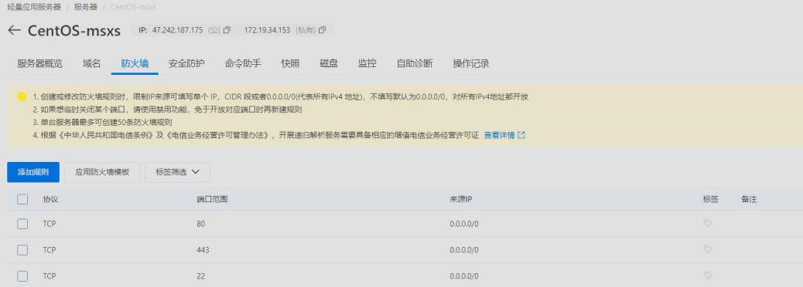

## 步骤六：配置 GitHub Runner CI/CD

### 问题记录与解决方案
在配置过程中遇到了以下问题：

1. **Runner 版本过旧**：旧版 Runner（2.311.0）与 GitHub 服务端协议不兼容，即使显示 Connected，UI 仍显示 Offline
2. **系统 glibc 版本过旧**：CentOS 7 glibc 太旧，无法支持新版 Runner 依赖的 Node.js 20
3. **自动更新机制问题**：disableUpdate 配置未完全生效，Runner 自动更新后因 glibc 版本不兼容导致启动失败
4. **Token 管理问题**：Runner 注册 Token 有效期仅 1 小时

### 最终解决方案：Docker 容器化部署
使用 `myoung34/github-runner` Docker 镜像成功部署。

启动 Docker Runner：
```bash
docker run -d --restart always --name github-runner \
  -e REPO_URL="https://github.com/66776776/teamblog" \
  -e RUNNER_TOKEN="你的TOKEN" \
  -e RUNNER_NAME="docker-runner" \
  -e RUNNER_WORKDIR="/tmp/runner/work" \
  -e LABELS="docker,self-hosted" \
  -e DISABLE_AUTO_UPDATE=true \
  -v /var/run/docker.sock:/var/run/docker.sock \
  -v /tmp/runner:/tmp/runner \
  -v /www/wwwroot/myblog:/www/wwwroot/myblog \
  myoung34/github-runner:latest
```

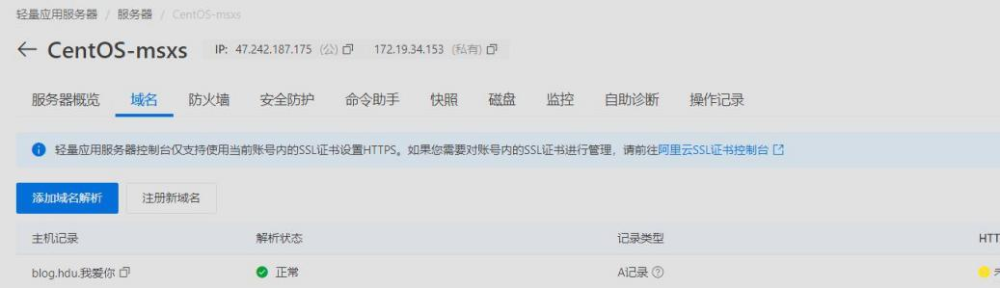
.png)

## 步骤七：创建 CI/CD 流水线

创建 `.github/workflows/deploy.yml`：
```yaml
name: 自动部署到阿里云
on:
  push:
    branches: [ main ]
jobs:
  deploy:
    runs-on: [self-hosted, docker]
    steps:
      - name: 检出代码
        uses: actions/checkout@v4
      - name: 安装Node.js
        uses: actions/setup-node@v4
        with:
          node-version: '18'
      - name: 安装依赖
        run: |
          npm install
      - name: 构建站点
        run: |
          npm run docs:build
      - name: 复制文件到网站目录
        run: |
          cp -r docs/.vitepress/dist/* /www/wwwroot/myblog/
      - name: 重载Nginx
        run: |
          docker exec $(docker ps -q --filter "name=baota" 2>/dev/null | head -1) \
            /www/server/nginx/sbin/nginx -s reload 2>/dev/null || \
          docker exec $(docker ps -q --filter "name=nginx" 2>/dev/null | head -1) \
            nginx -s reload 2>/dev/null || \
          echo "Nginx 重载将在下次访问时自动生效"
```

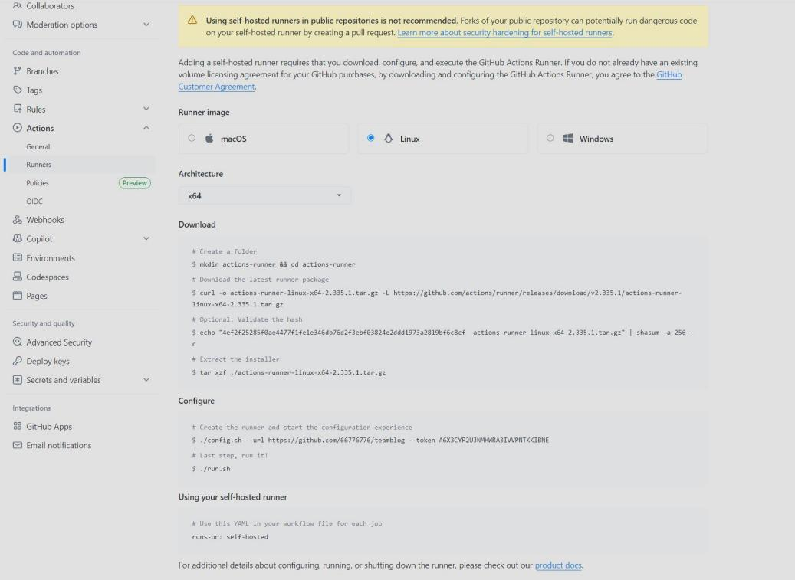
.png)
.png)

## 最终自动化部署流程

```
推送代码 → GitHub Actions 自动触发
    ↓
检出代码 → 安装依赖 → 构建站点 → 复制文件到网站目录
    ↓
服务器 inotify 监听到文件变化 → 自动重载 Nginx
    ↓
网站更新完成
```

### 服务器自动监听脚本
安装 inotify-tools 并启动自动重载脚本：
```bash
yum install -y inotify-tools

nohup bash -c '
while true; do
  inotifywait -r -e modify,create,delete /www/wwwroot/myblog/ 2>/dev/null
  /www/server/nginx/sbin/nginx -s reload
  echo "$(date) Nginx auto reloaded" >> /var/log/nginx-auto-reload.log
done
' &
```

开机自启配置：
```bash
echo 'nohup bash -c "
while true; do
  inotifywait -r -e modify,create,delete /www/wwwroot/myblog/ 2>/dev/null
  /www/server/nginx/sbin/nginx -s reload
done
" &' >> /etc/rc.local
chmod +x /etc/rc.local
```


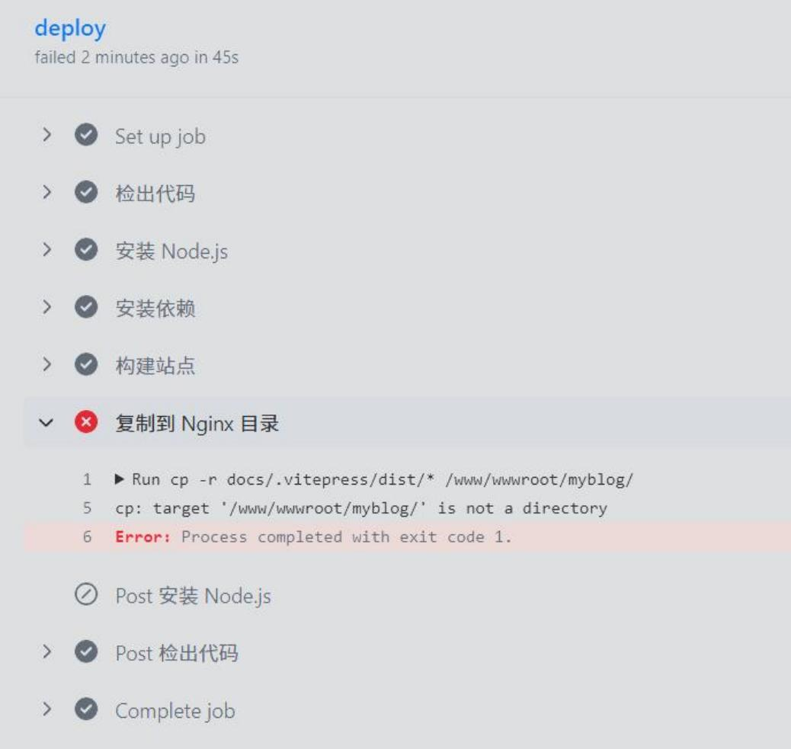
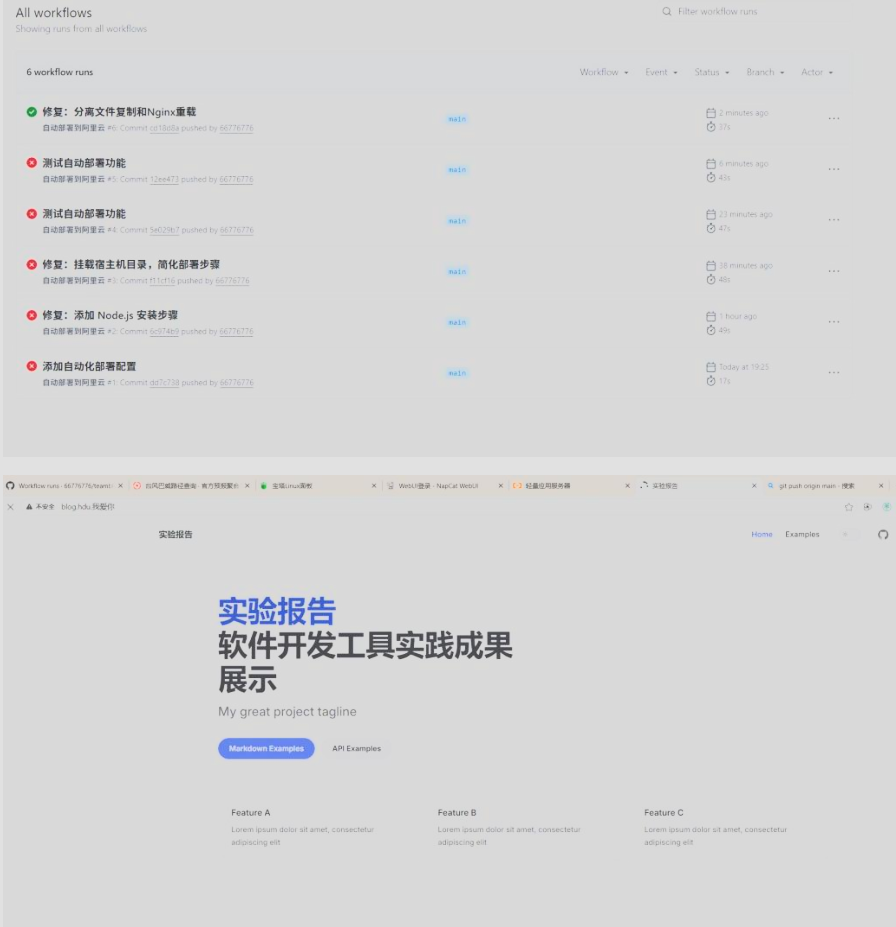
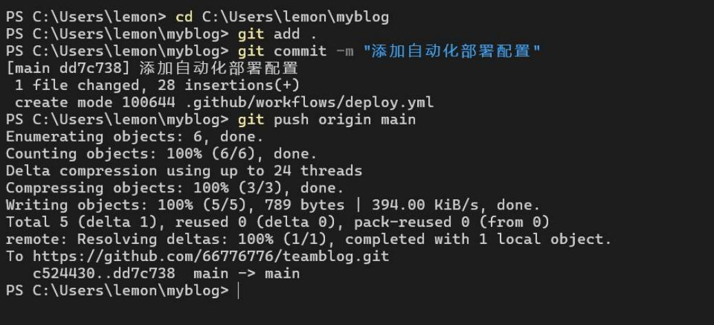
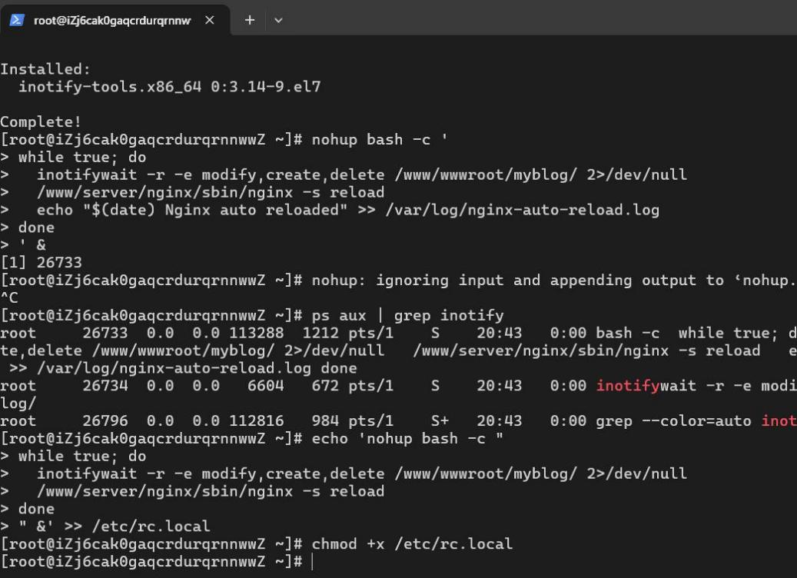
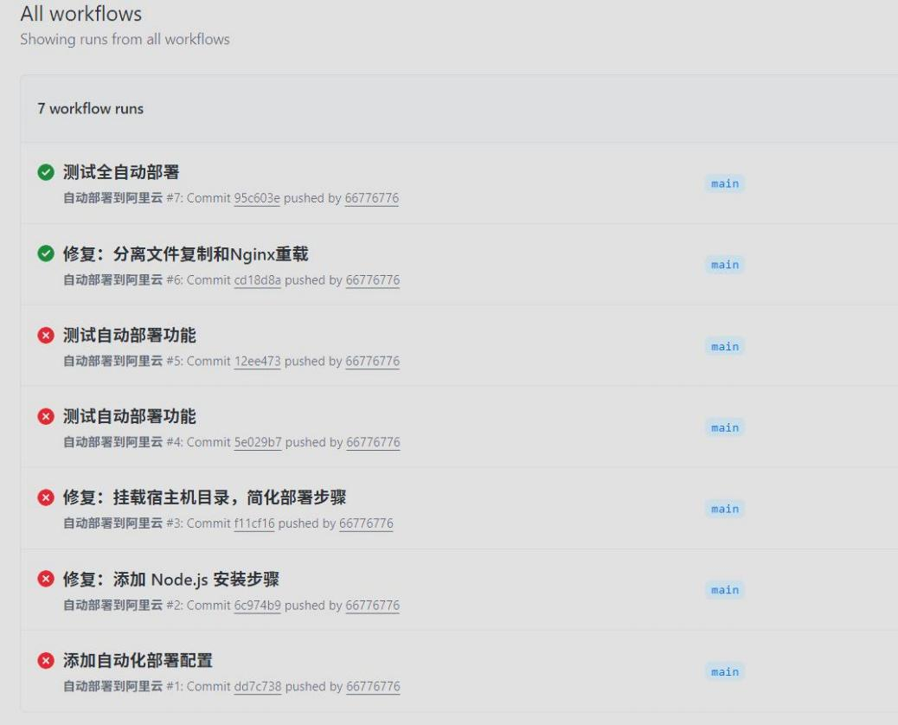
