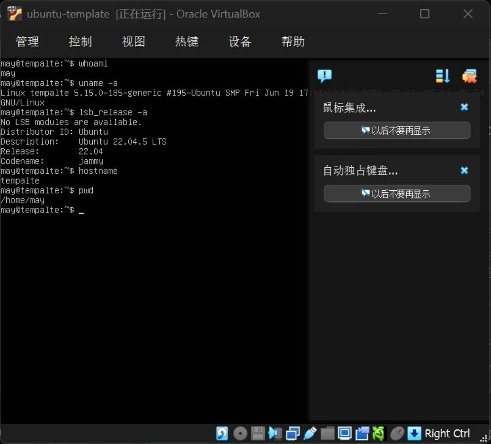
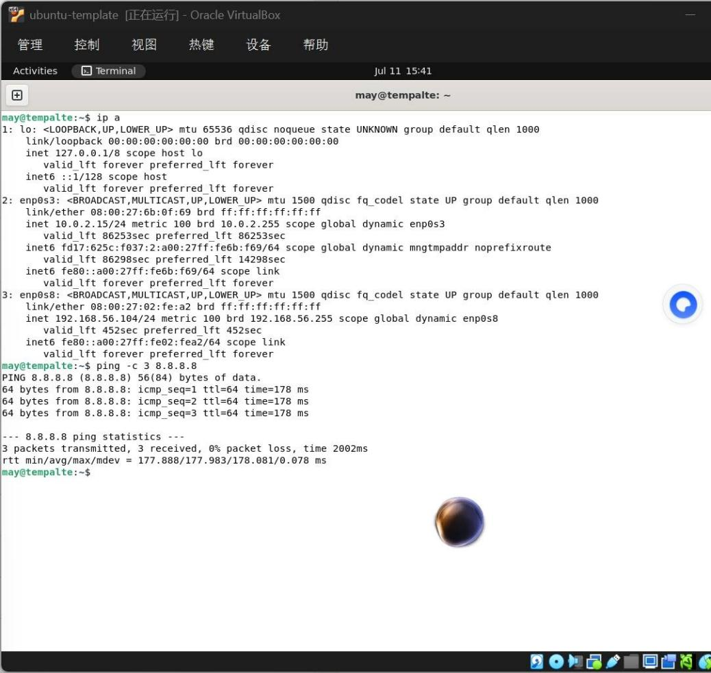
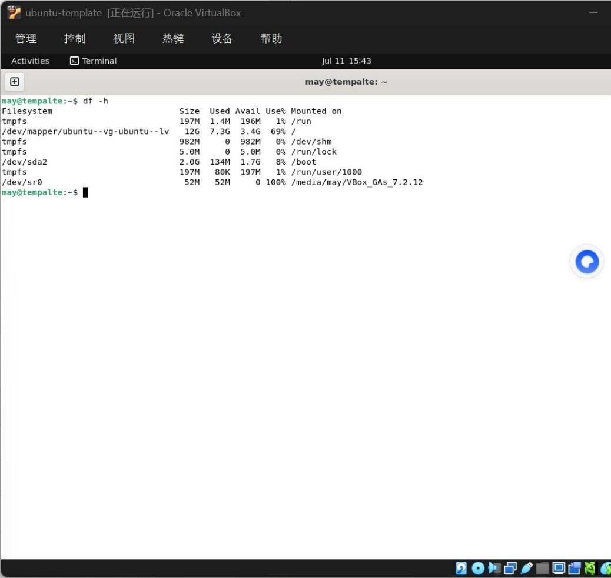
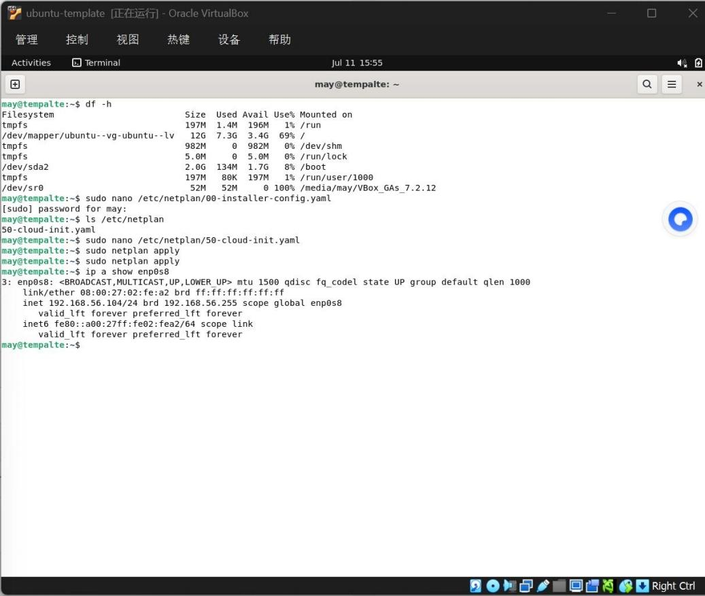
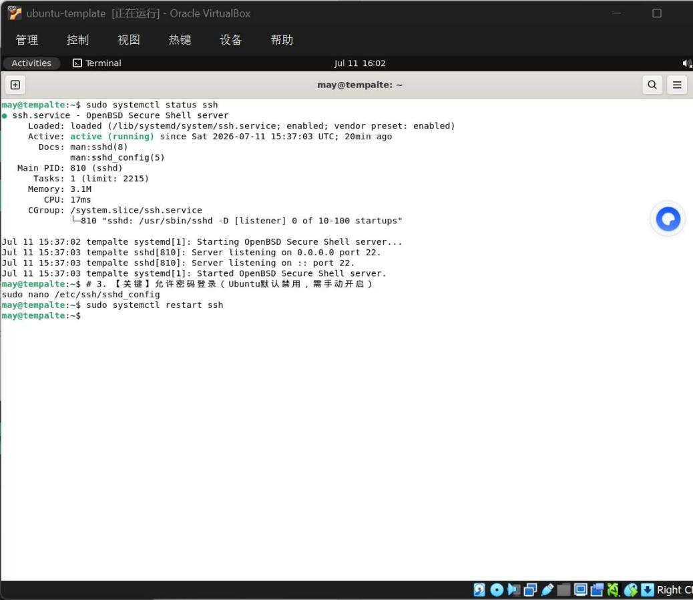
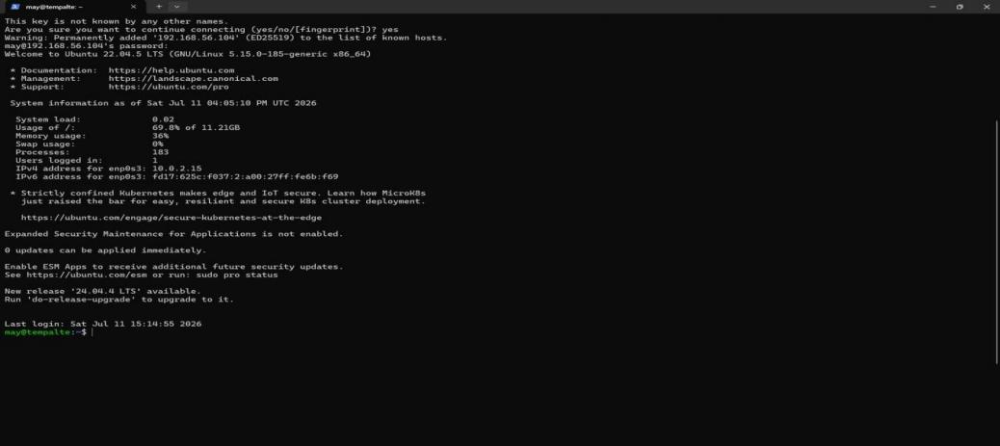
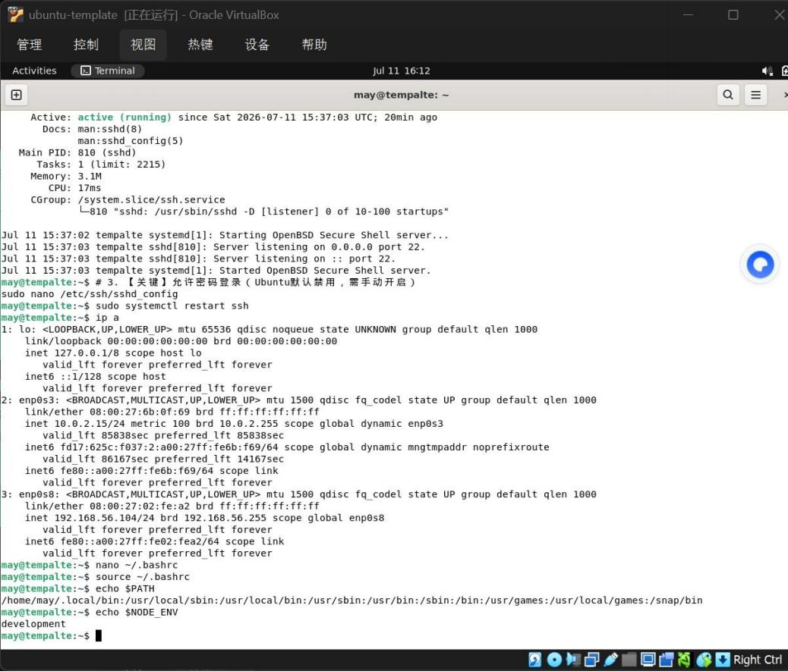
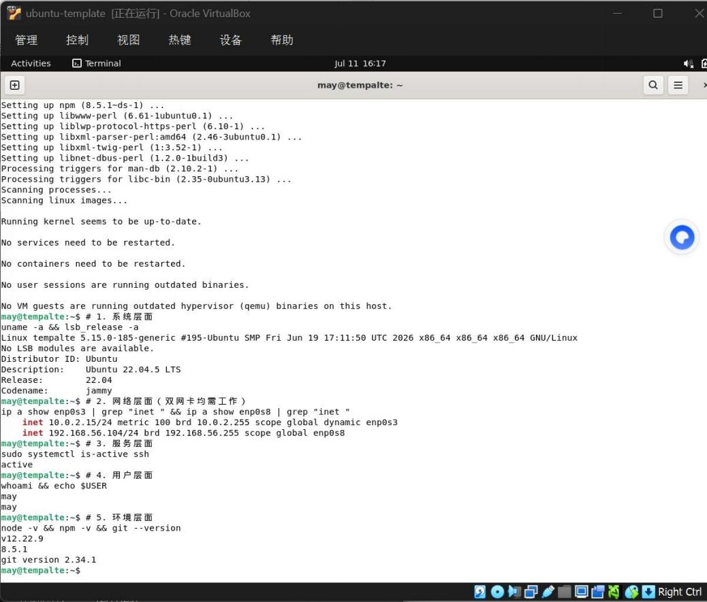

# 实验六

## 步骤一：查看系统信息

```bash
whoami                    # 查看当前用户
uname -a                  # 查看内核与架构信息
lsb_release -a            # 查看 Ubuntu 版本
hostname                  # 查看主机名
pwd                       # 查看当前工作目录
```





### 查看网络配置

```bash
ip a
ping -c 3 8.8.8.8
```

`ip a`（替代老旧的 ifconfig）列出所有网卡及其 IP。重点观察 enp0s3（NAT 网卡，应有 DHCP 分配的 IP）和 enp0s8（仅主机网卡，应为 192.168.56.101/24）。ping 测试外网连通性。

若 enp0s3 无 IP，检查 VirtualBox 设置中该网卡是否启用；若 ping 失败，检查宿主机防火墙或网络连接。

### 查看磁盘空间

```bash
df -h
```

`-h` 参数表示 "human-readable"，以 GB/MB 显示。重点关注 `/`（根分区）剩余空间，应 ≥10GB。若空间不足，需在 VirtualBox 中扩容硬盘或清理 `/var/log/` 日志。

## 步骤二：配置静态 IP（针对 enp0s8 仅主机网卡）

实验五中配置了双网卡：enp0s3（NAT，用于上网）和 enp0s8（仅主机，用于虚拟机之间通信）。实验六要求为 enp0s8 配置一个固定 IP（如 192.168.56.101），这是后续实验七（SSH远程登录）和实验八（集群部署）的网络基石。若不配置，虚拟机之间无法稳定通信。



## 步骤三：配置 SSH 服务（为实验七铺路）

```bash
# 1. 检查 SSH 服务状态
sudo systemctl status ssh

# 2. 若未运行，启动并设为开机自启
sudo systemctl enable --now ssh

# 3. 【关键】允许密码登录（Ubuntu默认禁用，需手动开启）
sudo nano /etc/ssh/sshd_config
# 找到 PasswordAuthentication 设置为 yes

# 4. 重启 SSH 服务使配置生效
sudo systemctl restart ssh
```

验证：在 Windows 宿主机上，打开 PowerShell，执行：
```bash
ssh your_username@192.168.56.104
```
若能成功登录，即配置成功。




## 步骤四：配置环境变量（为实验八部署做准备）

```bash
# 1. 编辑当前用户的环境变量文件
nano ~/.bashrc

# 2. 在文件末尾添加
export PATH="$HOME/.local/bin:$PATH"
export NODE_ENV=development

# 3. 使配置立即生效
source ~/.bashrc

# 4. 验证
echo $PATH
echo $NODE_ENV
```

`echo $PATH`，输出里能看到 `/home/may/.local/bin` 已经被追加到路径开头。`echo $NODE_ENV`，终端会直接打印出 `development`，就代表配置完全生效了。



### 【终极验证】完成实验六的标志性动作

```bash
# 1. 系统层面
uname -a && lsb_release -a

# 2. 网络层面（双网卡均需工作）
ip a show enp0s3 | grep "inet " && ip a show enp0s8 | grep "inet "

# 3. 服务层面
sudo systemctl is-active ssh

# 4. 用户层面
whoami && echo $USER

# 5. 环境层面
node -v && npm -v && git --version
```
成功标志：所有命令均返回有效结果，无 `command not found` 或 `failed` 字样。


