# 实验四：Hexo 博客搭建与 GitHub Pages 部署

## 步骤一：环境准备
确保已安装 Node.js 和 Git。

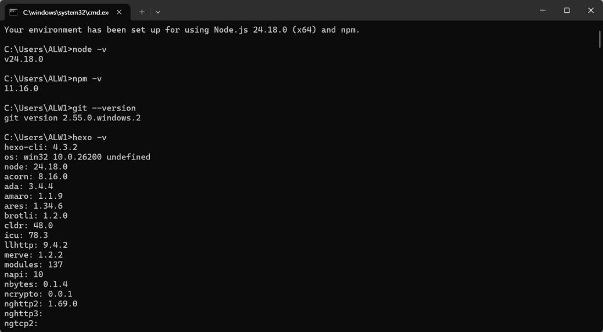

## 步骤二：安装 Hexo CLI
```bash
npm install -g hexo-cli
```

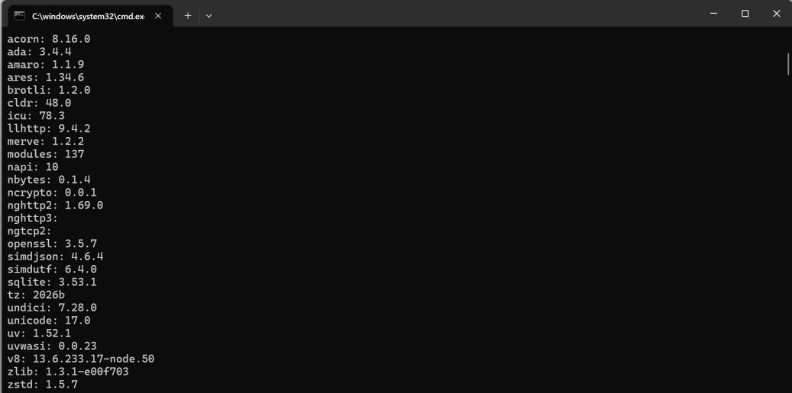

## 步骤三：初始化博客项目
选择一个存放博客的目录（例如 D:\Blog），进入该目录；执行初始化命令；进入项目目录；手动安装依赖。
```bash
hexo init my-blog
cd my-blog
npm install
```

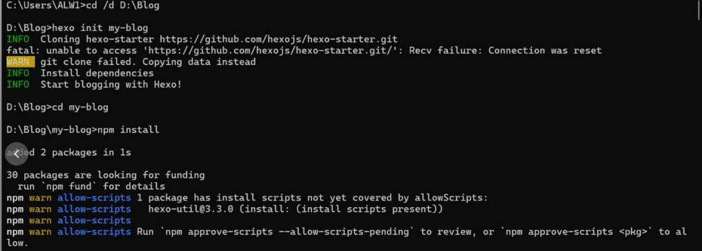

## 步骤四：本地预览博客
```bash
hexo server
```
可看到默认的 Hexo 博客首页。

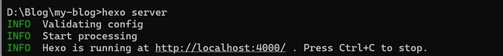

## 步骤五：创建并编写博客文章
1. 在项目目录下创建一篇新文章：
```bash
hexo new "我的第一篇文章"
```
2. 用 VS Code 打开该文件，编写 Markdown 内容。
3. 保存文件后，重新生成静态页面：
```bash
hexo generate
```
4. 刷新浏览器，可看到新文章出现在博客首页。

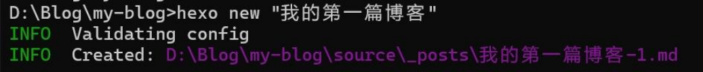
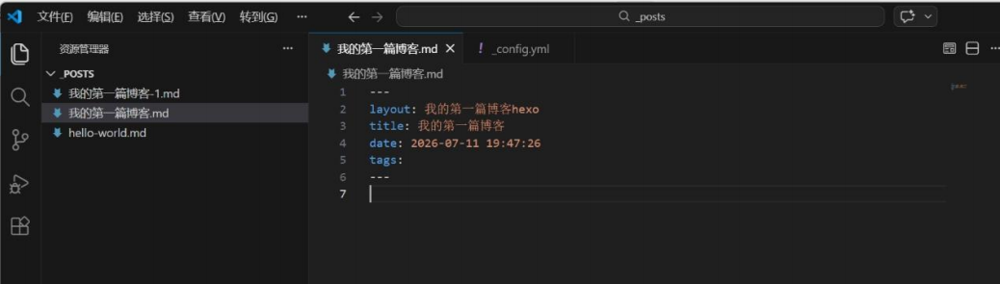
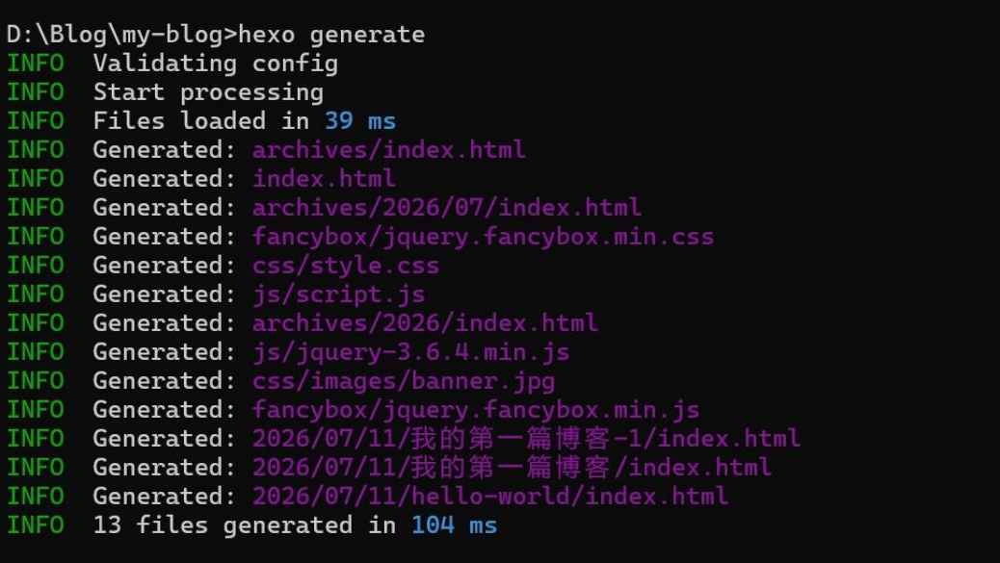
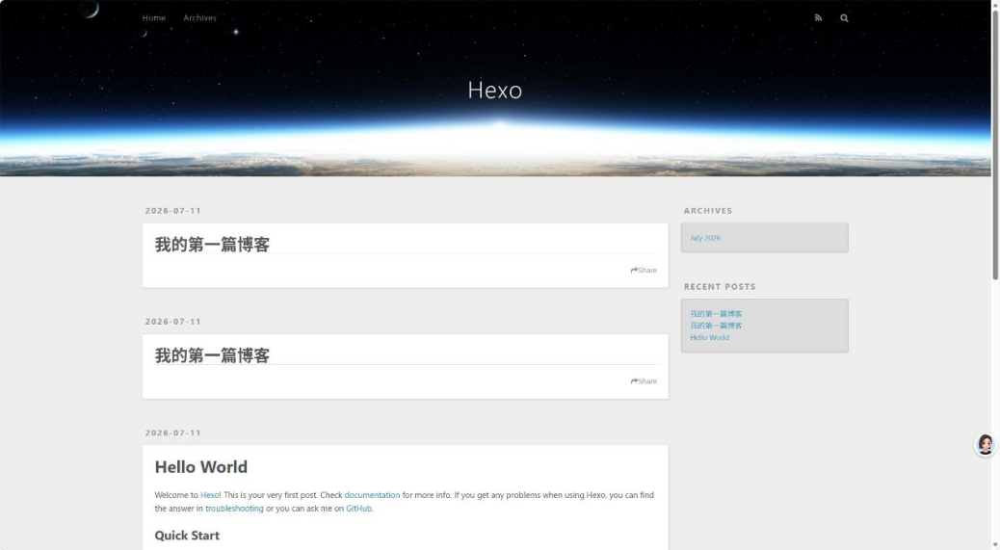

## 步骤六：部署到 GitHub Pages
1. 创建 GitHub 仓库。
2. 安装部署插件：
```bash
npm install hexo-deployer-git --save
```
3. 配置部署信息（修改 _config.yml）：
```yaml
deploy:
  type: git
  repo: https://github.com/你的用户名/你的仓库.git
  branch: gh-pages
```
4. 执行部署：
```bash
hexo deploy
```
5. 访问你的博客，可看到博客正式上线。

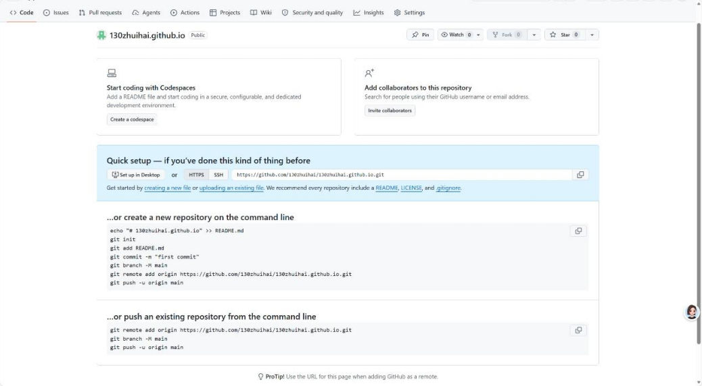
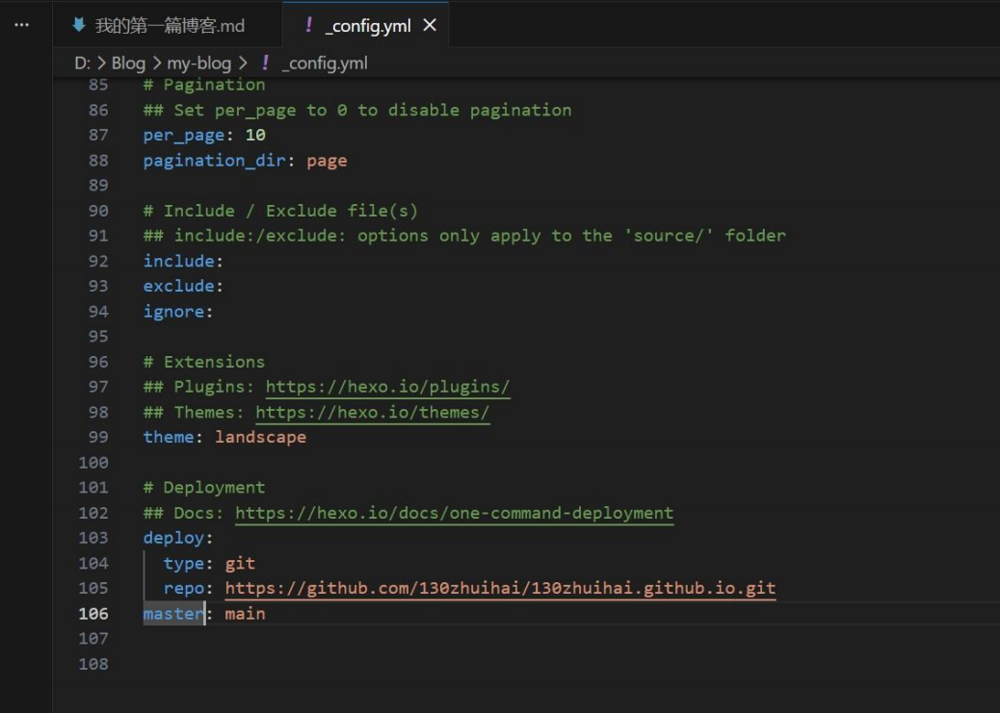
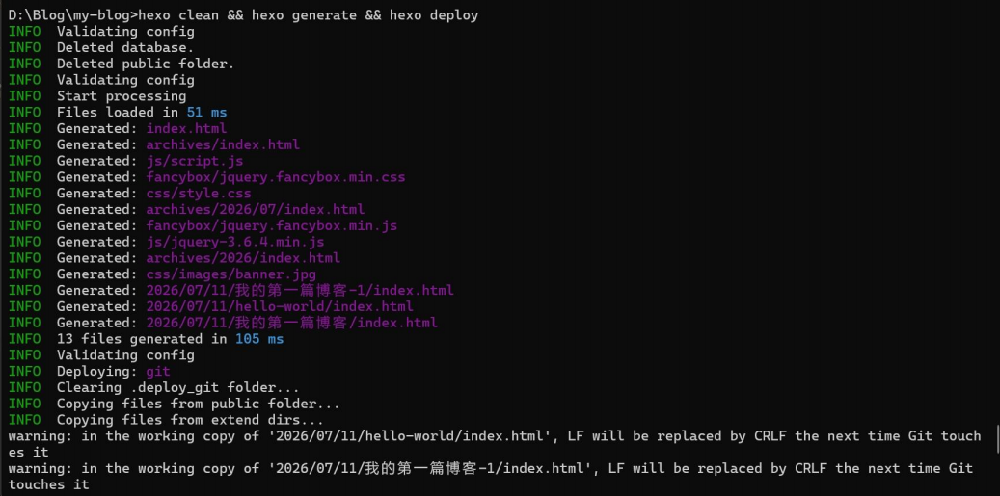
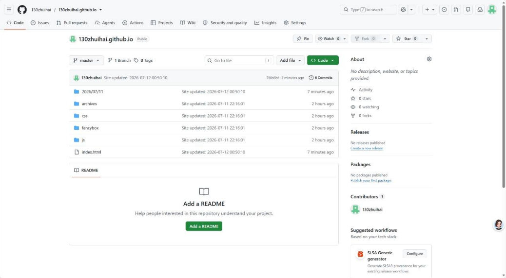
.png)
